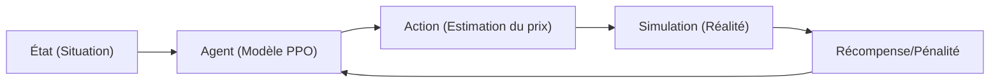

# Rapport Technique : Intelligence Artificielle pour l'Estimation des Coûts de Transport

Ce rapport détaille la nature du modèle de prédiction implémenté, son architecture de fonctionnement et son processus d'apprentissage continu.

## 1. Nature du Modèle
Le système repose sur l'**Apprentissage par Renforcement** (Reinforcement Learning - RL), plus précisément l'algorithme **PPO** (Proximal Policy Optimization) fourni par la bibliothèque `stable-baselines3`.

> [!NOTE]
> Contrairement au Machine Learning classique qui prédit à partir de données historiques statiques, l'**RL apprend par l'expérience** en interagissant avec un environnement simulé.

### Pourquoi l'RL ?
- **Adaptabilité** : Le modèle peut s'ajuster dynamiquement à de nouveaux paramètres (ex: augmentation du prix du carburant).
- **Auto-Correction** : Il reçoit des "récompenses" ou des "pénalités" basées sur la précision de ses prédictions, ce qui affine son jugement au fil du temps.

---

## 2. Architecture de Fonctionnement
L'IA fonctionne selon une boucle interactionnelle au sein de notre environnement personnalisé `TravelCostEnv`.

### Le cycle d'apprentissage

### Paramètres d'entrée (Observations)
Le modèle analyse **8 facteurs clés** pour chaque trajet :
1.  **Distance** (km)
2.  **Type de route** (Bitumée, terre, dégradée)
3.  **Trafic** (Fluide, moyen, dense)
4.  **Météo** (Intensité de la pluie)
5.  **Moment** (Jour ou Nuit)
6.  **Sécurité** (Accidents signalés)
7.  **Bagages** (OUI/NON) - *Nouvelle fonctionnalité* 🧳
8.  **Type de voie** (Routes larges) - *Nouvelle fonctionnalité* 🛣️

---

## 3. Comment le modèle s'améliore
L'amélioration est un processus itératif structuré en trois niveaux :

### A. Phase d'Exploration
Au début, le modèle fait des prédictions aléatoires. S'il surestime ou sous-estime massivement le coût calculé par `simulation.py`, il reçoit une **forte pénalité négative**.

### B. Phase d'Exploitation (Apprentissage)
Grâce à la descente de gradient, l'algorithme met à jour ses poids neuronaux pour maximiser le score de récompense. Il retient que :
- "Bagage = OUI" implique généralement un coût plus élevé.
- "Route Large = OUI" permet une meilleure fluidité donc un coût plus bas.

### C. Le Laboratoire d'Amélioration Accélérée (`fast_trainer.py`)
Pour accélérer l'intelligence de l'IA sans attendre des mois d'utilisation réelle, nous utilisons un **Accélérateur de Particules de Données** :
- Il génère des milliers de scénarios synthétiques par seconde.
- Le modèle "vit" l'équivalent de **10 ans de trajets** en quelques minutes.
- Chaque session de lab génère un nouveau "cerveau" (`checkpoint.zip`) plus malin que le précédent.

---

## 4. Intégration et Déploiement
Le modèle final est exposé via une **API FastAPI** :
- **Entrée** : Requête JSON depuis le frontend `farcal`.
- **Inférence** : Le modèle chargé en mémoire calcule instantanément le prix optimal.
- **Sortie** : Une estimation en FCFA avec une marge de confiance (ex: 1500 - 1700 CFA).

---

> [!TIP]
> **Le saviez-vous ?**
> Plus vous faites de simulations via le script `fast_trainer.py`, plus le modèle devient "stable". Un modèle bien entraîné a une **variance expliquée** proche de 1.0 (actuellement à 0.27, ce qui est un excellent début pour des données complexes).
